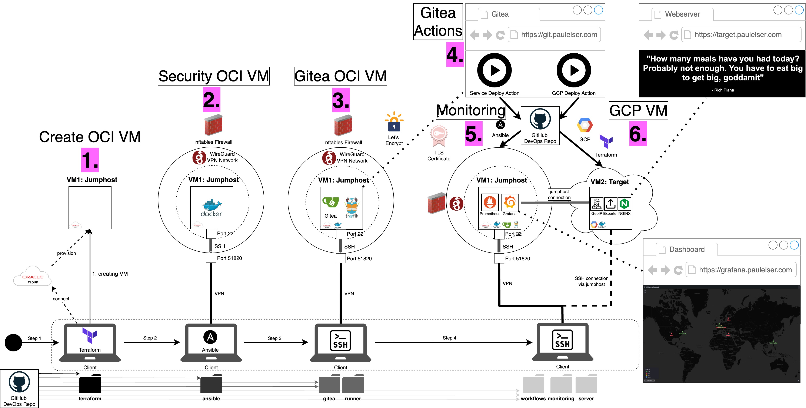

## You always wanted to start with the "CLOUD" but never knew how?

Luckily, I got you covered: You will learn how to use *always free* cloud ressources by Google's GCP and Oracle's OCI:
- use Terraform to spin up VMs for both GCP and OCI automatically with one click
- use Ansible to configure the VMs with just one command
- set up your own Wireguard VPN server and learn about nft firewalling and using jumphosts for security
- set up your own Gitea git server and Traefik reverse proxy
- use your own domain, change DNS settings and establish your own Let's Encrypt TLS certificate
- use your own Gitea runner to perform actions that deploy your own NGINX webserver on a second VM
- gather metrics with Prometheus and observe them on your own Grafana dashboard

Those are a hell lot of topics and nitty-gritty details to learn about. Every step is described in detail on my website [paulelser.com](https://www.paulelser.com/blog).

To give you a broad overview, have a look here:


## Instructions
What do you need to do to get the project up and running?

### 0a. Install basic technologies on host system.
This setup will consist of 3 machines:
1. The *host* (your private computer or laptop)
2. The *jumphost* or the *first VM* on *OCI*
3. The *target* or the *second VM* on *GCP*

First you need to prepare your own host and then we can setup the two VMs.
There are a couple of technologies you need to install manually first (in case you are not already using them). Since I don't know which machine you are using, I can only link you to the official installation guidelines:
- Docker (e.g. Docker Desktop): [Install Docker](https://docs.docker.com/desktop/)
- Python: [Install Python](https://www.python.org/?downloads/)
- Ansible: [Install Ansible](https://docs.ansible.com/ansible/latest/installation_guide/intro_installation.html)
- Terraform: [Install Terraform](https://developer.hashicorp.com/terraform/install)
- Git: [Install Git](https://git-scm.com/book/en/v2/Getting-Started-Installing-Git)

Also: You don't have to but for learning purposes it makes sense to acquire your own domain. This can be done through many different domain registrars but you should be able to find an offer for around 10 - 15 USD per year. I opted for using my fullname.com to use this as my digital business card.

### 0b. Clone this repository to your local machine
```bash
git clone git@github.com:PaulElser/DevOps.git
cd ./DevOps
```

### 0c. Create an Oracle OCI user account and set up API key
  - This step needs to be done manually and can't be automized.
  - Create an Oracle OCI account [here](https://www.oracle.com/cloud/)
  - Use [the official documentation](https://docs.oracle.com/en-us/iaas/Content/API/Concepts/apisigningkey.htm) to set up an API key and fill out the variables in `terraform/terraform.tfvars`.

### 0d. Create a Google GCP user account and set up a Service Account key
  - This step also needs to be done manually.
  - Create a Google GCP account [here](https://cloud.google.com/). Unfortunately you have to add your credit card information. However, you won't get charged while staying in the limits of the always-free tier which will be used in this tutorial. I still have to add that it is much more easy to accidentally create wrong configurations that will cost you money after the free trial. So please be careful and set budget reminders.
  - Create a new project and go to `Enable APIs and Services`. There you have to enable the `Compute Engine API` and the `Cloud Resource Manager API`.
  - In order to automatically run Terraform scripts, you have to create a service account: Go to `IAM & Admin` and then to `Service Accounts`. There you create an account and add the roles `Compute Admin` and `Service Account User`. 
  - From there you can `Manage keys`, add a new key and download it in JSON format. This one will have to be added to your Gitea repository as a Secret in step 4.

### 1. Create the first VM with Terraform on Oracle's OCI
```bash
cd terraform/oci
terraform init
terraform plan
terraform apply
```
  - Details [in my blog post](https://paulelser.com/blog/terraform-provisioning#basic-setup-terraform)

### 2. Install Wireguard VPN and Firewall rules on OCI VM
  - Before being able to run the Ansible playbooks, you will have to adjust the `inventory.yml` file: Your `ansible_host`, `ansible_user` and `ansible_ssh_private_key_file` will vary.
```bash
cd ansible
sudo ansible-playbook -i inventory.yml playbooks/install_docker.yml
sudo ansible-playbook -i inventory.yml playbooks/install_wireguard.yml
sudo ansible-playbook -i inventory.yml playbooks/apply_nftables_rules.yml
```
  - Details [in my blog post](https://paulelser.com/blog/wireguard-vpn-and-firewalling)
  - I configured Wireguard for my own system which is MacOS. Since I did it in the terminal, it might be very similar on UNIX systems but different on Windows machines. Please let me know if your configuration deviated from mine so I can add it as an example here.
  - If you chose to use your own domain name you can now go on your registrar's website and create a DNS A record with a hostname (e.g. *jump*) and the IP address of your VPN server (e.g. 10.10.0.1). This makes it easier for you to use jump.yourdomain.com instead of an IP address in your Ansible inventory file or when you SSH your jumphost.
  - (While you are at it, also set the same entry and IP address for *git*, *grafana* and *prometheus* which you will need later on)

### 3. Install Gitea and Traefik and Let's Encrypt certificates on the OCI VM
  - Copy the `gitea` folder to you VM, SSH onto it and start the certificate creation process
```bash
scp -r gitea jump.yourdomain.com:gitea
ssh jump.yourdomain.com
cd gitea
./get_cert.sh
```
  - Here you will need to fulfill a DNS challenge which requires you to add the challenge (a string) as a DNS entry 
  - Details [in my blog post](https://paulelser.com/blog/gitea)
  - Now you can run your Docker Compose file
```bash
docker compose up -d
```
  - You can access your running Gitea instance on git.yourdomain.com if you have set it up in the previous step. There you need to create your first user, which will be an admin. Also create your first repository and clone it to your jumphost. We will need this for running Gitea Actions in the next step.

### 4. Activate Gitea Actions
  - In this step we will already copy the folders needed for the next three sections. But don't worry, we'll go through them one by one.
  - Copy the `workflows` folder from your host into the repository you have just created on your VM.
  - You don't have to also copy the `monitoring` and `server` folders. They  are needed in step 5 and 6 but will be automatically fetched by the Action. However, in case the Action fails or you want to deploy monitoring and server manually, you have the possibility to do it.
```bash
scp -r workflows jump.yourdomain.com:your-repo/.gitea
scp -r monitoring jump.yourdomain.com:monitoring
scp -r server target.yourdomain.com:server
```
  - The workflows need you to set up three secrets in the Gitea UI: `GCP_SA_KEY`, `GITHUB` and `VM_SSH_PRIVATE_KEY`. 
  - You can find details about the secrets [in my blog post](https://paulelser.com/blog/gitea-actions)
  - You also need to install the runner by going on *Settings* -> *Actions* -> *Runners* and then click on *Create new Runner* and copy the _Registration Token_. This needs to be added to the _docker-compose-yml_ file. 
  - Add the workflow you just copied and commit and push it to your own Gitea repository to trigger the Action. Actions can be triggered individually or all together by using a specific key word in the commit message. To trigger the `gcp_deploy.yml` action, use the word `gcp_deploy` in the message. For `server_deploy.yml` use `server_deploy` and similar for `monitoring_deploy`. There is also a possibility to trigger all three actions at the same time by adding `all_deploy` to the commit message.
```bash
git add .
git commit -m "Triggering gcp_deploy workflow"
git push
```
  - This will create the second *target VM* on GCP, outputs its IP and installs Docker on it via Ansible in the Gitea Action
  - If you want to make access to and handling of the GCP VM easier, go to your domain registrar again and set another DNS A record with name *target* and the corresponding IP address

### 5. Set up monitoring on the OCI VM
  - You have already copied the `monitoring` folder from your host to the jumphost
```bash
scp -r monitoring jump.yourdomain.com:monitoring
```
  - Run the Docker containers
```bash
docker compose up -d
```
  - Unfortunately, I didn't manage to run this in a Gitea Action due to errors of mounting the prometheus.yml into the container. I would be very pleased to hear about possible ideas from you!
```bash
git add .
git commit -m "Triggering monitoring_deploy workflow"
git push
```
  - Details [in my blog post](https://paulelser.com/blog/gitea-actions2)
  - The monitoring containers Grafana and Prometheus can be accessed on grafana.yourdomain.com and prometheus.yourdomain.com if you have set it up accordingly in the previous steps

### 6. Set up server on GCP VM
  - You have already copied the `server` folder from your host to the target
```bash
scp -r server target.yourdomain.com:server
```
  - SSH onto the target VM, download the GeoIP database with the `download_geoip.sh` script and run the Docker compose file
```bash
ssh target.yourdomain.com
cd server
chmod +x download_geoip.sh
./download_geoip.sh
docker compose build
docker compose up -d
```
  - or trigger this workflow as a Gitea Action from your jumphost:
```bash
git add .
git commit -m "Triggering server_deploy workflow"
git push
```
  - If everything worked out well you can now access target.yourdomain.com to see publicly available webserver
  - You can also access grafana.yourdomain.com and import the dashboard to see basic stats about your webserver and a map that locates requests on your webserver from all over the world. Invite your international friends to access your website and track it on the dashboard almost in real time!
  - I have a sample dashboard that gives you basic stats about the server and show the GeoIP map. You can import it by clicking on *Dashboards* -> *New* -> *Import* and then just drag and drop _GeoIPDashboard.json_ to Grafana
  - Details [in my blog post](https://paulelser.com/blog/gitea-actions2)

### TBD: 7. How to Deinstall
  - You might want to shut down your cloud ressources after testing them out:
  - TBD

### TBD: 8. Backup Strategy
  - I had to painfully experience on my own how important it is to have a backup strategy
  - TBD
